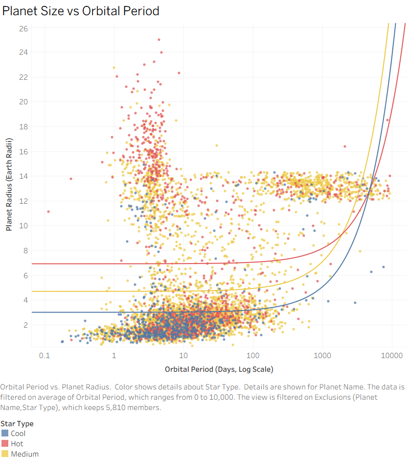
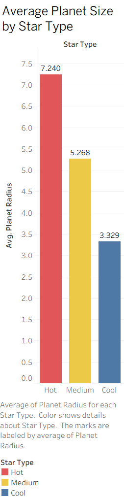
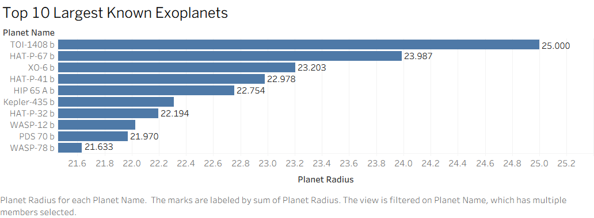

# 🌌 Exoplanet Data Analysis (SQL + Tableau)

## 🚀 Overview

This project explores patterns in confirmed exoplanets using data from NASA.

Using SQL and Tableau, I analyzed how planetary size relates to orbital behavior and host star characteristics, uncovering trends in planetary formation and observational bias.

---

## 🎯 Key Findings

* Planet size shows little correlation with orbital period
* Exoplanets cluster into two main groups: small rocky planets and large gas giants
* Hot stars tend to host larger planets on average
* Short orbital period planets are overrepresented, likely due to detection bias


---

## 🧰 Tools Used

* MySQL (data cleaning & transformation)
* Tableau (data visualization & dashboard design)
* Excel (initial data inspection)

---

## 📁 Dataset

Source: NASA Exoplanet Archive
Includes confirmed exoplanets with attributes such as:

* Planet radius
* Orbital period
* Star temperature
* Distance from Earth

---

## 🧹 Data Preparation (SQL)

The dataset was cleaned and transformed using MySQL:

* Removed incomplete records
* Filtered out extreme outliers
* Created derived feature: `star_type` based on star temperature

Example transformation:

```sql
UPDATE exoplanets
SET star_type = 
    CASE 
        WHEN star_temperature < 4000 THEN 'Cool'
        WHEN star_temperature BETWEEN 4000 AND 6000 THEN 'Medium'
        ELSE 'Hot'
    END;
```

---

## 🔍 Key Questions

* Do larger planets orbit closer or farther from their stars?
* Does star temperature influence planet size?
* What are the largest known exoplanets?

---

## 📈 Key Visualizations

### 1. Planet Size vs Orbital Period



* No strong correlation between planet size and orbital period
* Clear clustering of small rocky planets vs large gas giants
* Short orbital period planets are overrepresented (likely detection bias)

---

### 2. Average Planet Size by Star Type



* Hot stars tend to host larger planets on average
* Suggests differences in planetary formation or detection patterns

---

### 3. Top 10 Largest Exoplanets



* Highlights extreme outliers in planetary size
* Useful for identifying gas giant trends

---

## 🧠 Key Insights

* Planet size does not strongly correlate with orbital period
* Exoplanets cluster into two main groups: rocky planets and gas giants
* Star temperature shows a stronger relationship with planet size
* Detection bias likely influences observed distributions

---

## 🚀 What This Demonstrates

* Data cleaning and transformation using SQL
* Exploratory data analysis
* Data visualization best practices
* Ability to communicate insights clearly

---

## 💡 Skills Demonstrated

* SQL data cleaning and transformation
* Exploratory data analysis
* Data visualization with Tableau
* Analytical thinking and insight communication

